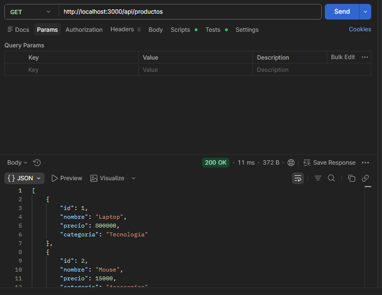
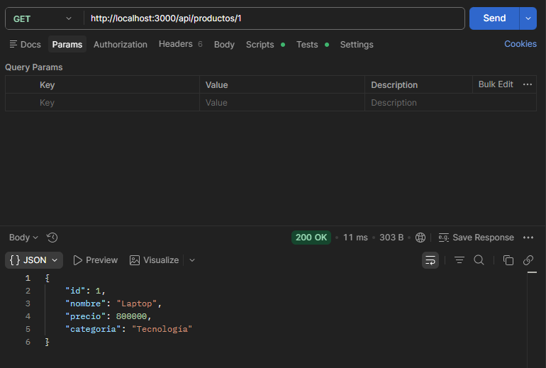
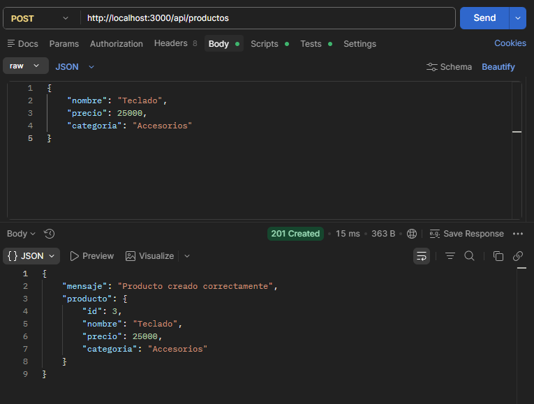
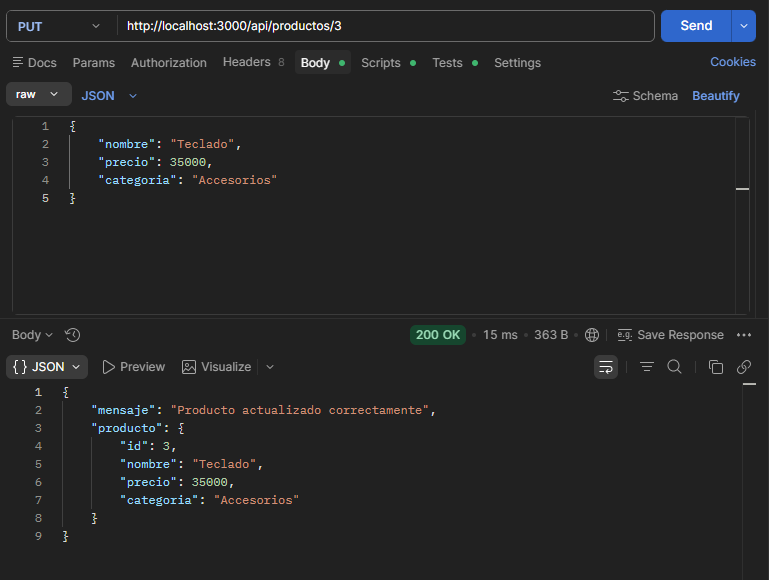
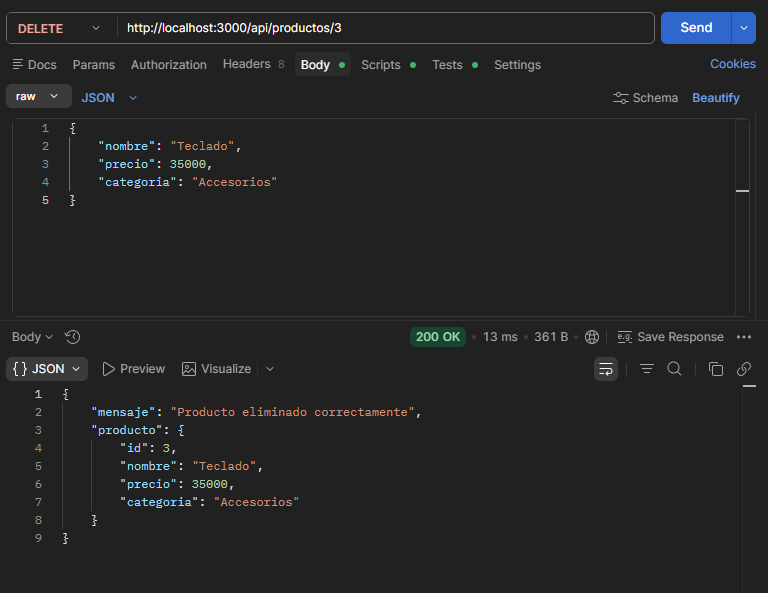
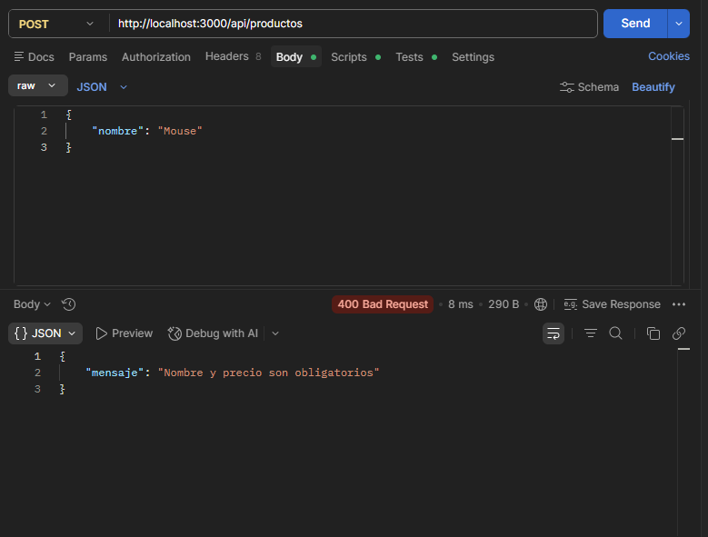
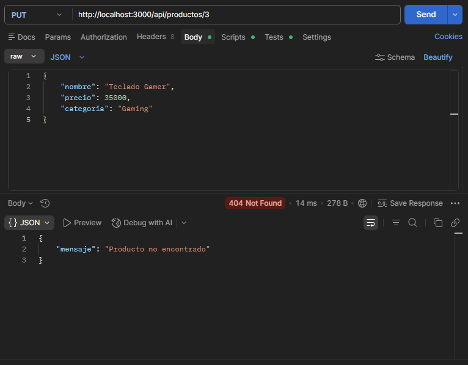

# API de Productos con Express.js

## Descripción

Esta aplicación es una API RESTful desarrollada con Node.js y Express.js que permite gestionar productos mediante operaciones CRUD.

La API permite:

- Listar productos
- Obtener un producto por ID
- Crear productos
- Actualizar productos
- Eliminar productos

Los datos se almacenan en un arreglo dentro del archivo data.js.

---

# Tecnologías utilizadas

- Node.js
- Express.js
- Postman

---

# Instalación

## Inicializar proyecto

```bash
npm init -y
```

## Instalar dependencias

```bash
npm install express
```

---

# Ejecución

Para iniciar el servidor:

```bash
node index.js
```

Servidor disponible en:

```text
http://localhost:3000
```

---

# Estructura del proyecto

```text
api-productos
│
├── index.js
├── routes.js
├── data.js
├── package.json
└── README.md
```

---

# Pruebas realizadas

## 1. GET - Listar todos los productos

### Petición

```http
GET http://localhost:3000/api/productos
```

### Respuesta

```json
[
  {
    "id": 1,
    "nombre": "Laptop",
    "precio": 800000,
    "categoria": "Tecnología"
  }
]
```

### Evidencia

Insertar captura aquí.



---

## 2. GET - Obtener producto por ID

### Petición

```http
GET http://localhost:3000/api/productos/1
```

### Respuesta

```json
{
  "id": 1,
  "nombre": "Laptop",
  "precio": 800000,
  "categoria": "Tecnología"
}
```

### Evidencia

Insertar captura aquí.



---

## 3. POST - Crear producto

### Petición

```http
POST http://localhost:3000/api/productos
```

### Body

```json
{
  "nombre": "Teclado",
  "precio": 25000,
  "categoria": "Accesorios"
}
```

### Respuesta

```json
{
  "mensaje": "Producto creado correctamente"
}
```

### Evidencia

Insertar captura aquí.



---

## 4. PUT - Actualizar producto

### Petición

```http
PUT http://localhost:3000/api/productos/3
```

### Body

```json
{
  "nombre": "Teclado Gamer",
  "precio": 35000,
  "categoria": "Gaming"
}
```

### Respuesta

```json
{
  "mensaje": "Producto actualizado correctamente"
}
```

### Evidencia

Insertar captura aquí.



---

## 5. DELETE - Eliminar producto

### Petición

```http
DELETE http://localhost:3000/api/productos/3
```

### Respuesta

```json
{
  "mensaje": "Producto eliminado correctamente"
}
```

### Evidencia

Insertar captura aquí.



---

## 6. Error 400 - Datos inválidos

### Petición

```http
POST http://localhost:3000/api/productos
```

### Body

```json
{
  "nombre": "Mouse"
}
```

### Respuesta

```json
{
  "mensaje": "Nombre y precio son obligatorios"
}
```

### Evidencia

Insertar captura aquí.



---

## 7. Error 404 - Producto no encontrado

### Petición

```http
PUT http://localhost:3000/api/productos/999
```

### Respuesta

```json
{
  "mensaje": "Producto no encontrado"
}
```

### Evidencia

Insertar captura aquí.



---

# Conclusión

La API desarrollada cumple con los requisitos solicitados para implementar operaciones CRUD utilizando Express.js. Además, incorpora validaciones básicas y manejo de errores mediante códigos HTTP apropiados.